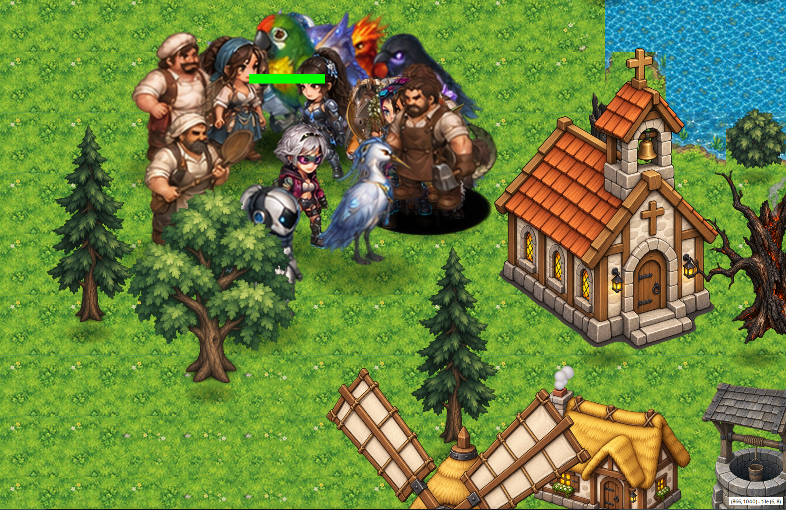

# ShadowShine



v0.6.9

> *A 100-chapter isometric RPG. Twenty-five chapters are done. The other seventy-five are, uh, "in the pipeline."*

**ShadowShine** (formerly "Umbraloom", until we decided nobody could spell it) is a from-scratch **C++20 / Qt6** isometric RPG engine, plus the story it runs. It's a rewrite of an old C/SDL2 engine, which lives on in `T2gu-legacy/` like an embarrassing photo in a parent's attic: preserved, unbuilt, and not to be touched.

## What you get

- **25 chapters**, from the cozy village of *Fernhollow* to *The Second Door*, by way of *The Nameless Threshold*, a name that suggests things go downhill. Along the way: *Ada Town*, *The Hollow Under*, *The Rusted Line*, *Ashfall*, and nineteen more towns that each come with their own maze, weather and quest. Levels alternate between running left to right and right to left, just to keep you honest.
- **115 characters**, each with 65 hand-... well, *machine*-posed sprites: idle, walk, run, defend, attack, skill, hit, die, dash and jump, front and back. That's 65 poses per character, or about 7,500 poses in total, and every one had to be checked for a stray caption or a leg cut off at the knee.
- **Real-time combat**, a party system, inventory, fireballs (only if you're smart enough; the engine checks your Intelligence stat and finds you wanting), riddles, hostages to rescue, and NPCs with opinions.
- **Levels that are the same every time you run them.** Layouts come from a seeded PRNG (`mulberry32`), not `Math.random()`, so when a tree spawns on your head it spawns on your head *reproducibly*, and we can fix it once and trust it forever.
- **Scripting in plain JavaScript.** Chapters are `function*` coroutines that `yield api.say("Old Man", "...")` until you press Enter. If you've ever wanted to write a boss fight as a generator function, this is your moment.

## Building

You need CMake, a C++20 compiler and Qt6 (Widgets, Qml, Multimedia).

```sh
cmake -S . -B build
cmake --build build -j$(nproc)
./build/T2gu2
```

It builds Release by default (`-O3`, `-march=native`, LTO), because we once lost an afternoon to an accidentally unoptimized build and we do not talk about it.

**Want to skip to a specific chapter?** Set `T2GU_MAP_PATH`:

```sh
T2GU_MAP_PATH=assets/maps/chapter4.json ./build/T2gu2
```

Yes, you can go straight to *The Rusted Line* without earning it. We won't judge. Much.

### Installing it (Linux)

```sh
cmake -S . -B build -DCMAKE_INSTALL_PREFIX=$HOME/.local   # or leave the default, /usr/local
cmake --build build -j$(nproc)
cmake --install build                                     # `make install` works too; sudo for /usr/local
```

That puts `T2gu2` in `<prefix>/bin`, the app icons in the hicolor icon theme, a `t2gu2.desktop` launcher in `<prefix>/share/applications` (so it shows up in your app menu as *ShadowShine*), and the whole `assets/` tree in `<prefix>/share/t2gu2/assets`. Fair warning: that last part is about 1 GB, because every character is a 4480×10120 sprite sheet and we have opinions about frames.

The installed game finds its assets on its own, next to the binary, so you can delete the source tree afterwards. Set `T2GU_ASSET_DIR` to point it somewhere else. Pick the prefix when you configure, not with `--prefix` at install time: the launcher's `Exec=` line is written from it. To uninstall, `xargs rm < build/install_manifest.txt` (it leaves some empty directories behind, which is between you and them).

## Controls

| Key | Does |
|---|---|
| `WASD` / arrows | Move |
| `Shift` | Run, for people in a hurry |
| `Ctrl` | Attack |
| `F` | Fireball (requires a brain) |
| `E` | Interact with whatever is nearby |
| `Enter` | Advance dialogue |
| `Tab` | Swap to the next party member |
| `I` | Inventory |
| `C` | Command the last character you clicked |
| `H` | Toggle health bars |
| `F5` / `F8` | Save / load |
| `F9` | Die on purpose, for when you want a fresh start or want to quit |
| `N` | Skip to the next chapter (debug, but also, you know, temptation) |
| `K` | **Pose parade**: loops your character through all 10 animation rows |

## The Sandbox

There's a sandbox map where **every character in the roster is a party member**. Press `Tab` to cycle through all 115 of them and `K` to watch each one perform every animation in slow motion. We built it to review sprites. It has since become the best way to watch a wolf, a gnome wizard and an android take turns dying.

```sh
T2GU_MAP_PATH=assets/maps/sandbox.json ./build/T2gu2
```

## A note on the art

The sprites are being regenerated by AI, and quality control is a full-time job. Highlights from our records:

- Characters cropped clean in half at the waist, like a magician's assistant on a bad day.
- A `bird_ice_swan` that was, on inspection, an owl. A `bird_jungle_parrot` that was a raven. A `bird_silver_heron` that was a green parrot. We are a *bird* game with a *bird identity crisis*.
- A crocodile whose run cycle had two of its own frames on top of each other, presumably in solidarity.
- The **Great Purge**: 18 characters were removed from the game entirely, including a `mech_scorpion`, a `minotaur` and a `slime_mercury`. The story-critical ones were quietly replaced by understudies. No refunds.
- Every new sprite sheet gets a *fine-tooth-comb* audit: caption burn, hard clipping, bleed between cells, and a check that the feet touch the ground. Yes, we found one where the feet didn't.

## Project layout

```
src/            all the C++ (flat, because we like to live dangerously)
assets/         characters, props, items, tilesets, maps, scripts, audio
docs/           SCRIPTING.md, the full api.* reference
tools/          one-off Python scripts for sprite wrangling
T2gu-legacy/    the C/SDL2 original. Look, don't touch.
AGENTS.md       architecture notes for contributors, human or otherwise
```

Want to write a chapter? Read [`docs/SCRIPTING.md`](docs/SCRIPTING.md). Want to change the engine? Read [`AGENTS.md`](AGENTS.md) first. It contains the history of every bug we've already made, so you can make new ones.

## Testing

There is no unit test suite. Our testing strategy is to run every chapter headless and stare at the terminal until it prints no warnings:

```sh
for ch in $(seq 1 16); do
  timeout 8 env QT_QPA_PLATFORM=offscreen T2GU_MAP_PATH="assets/maps/chapter$ch.json" ./build/T2gu2 2>&1 | grep -iE "error|warning|fatal|assert"
done
```

Silence means success. Silence is also what a crash sounds like. Run it twice.

## License

GPLv3. See [`LICENSE`](LICENSE). Share it, change it, ship it. Just don't blame us for what the boar does.
