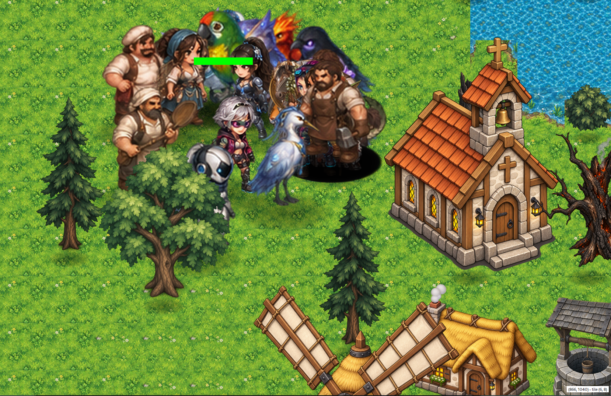

# ShadowShine



v8.0.1

> *A 100-chapter isometric RPG. Twenty-five chapters are done. The other seventy-five are, uh, "in the pipeline."*

**ShadowShine** (formerly "Umbraloom", until we decided nobody could spell it) is a from-scratch **C++20 / Qt6** isometric RPG engine, plus the story it runs. It's a rewrite of an old C/SDL2 engine, which lives on in `T2gu-legacy/` like an embarrassing photo in a parent's attic: preserved, unbuilt, and not to be touched.

## What you get

- **25 chapters**, from the cozy village of *Fernhollow* to *The Second Door*, by way of *The Nameless Threshold*, a name that suggests things go downhill. Along the way: *Ada Town*, *The Hollow Under*, *The Rusted Line*, *Ashfall*, and nineteen more towns that each come with their own maze, weather and quest. Levels alternate between running left to right and right to left, just to keep you honest.
- **99 characters**, each with 65 hand-... well, *machine*-posed sprites: idle, walk, run, defend, attack, skill, hit, die, dash and jump, front and back. That's 65 poses per character, or about 6,400 poses in total, and every one had to be checked for a stray caption or a leg cut off at the knee.
- **Real-time combat**, a party system, inventory, fireballs (only if you're smart enough; the engine checks your Intelligence stat and finds you wanting), riddles, hostages to rescue, and NPCs with opinions.
- **Levels that are the same every time you run them.** Layouts come from a seeded PRNG (`mulberry32`), not `Math.random()`, so when a tree spawns on your head it spawns on your head *reproducibly*, and we can fix it once and trust it forever.
- **Scripting in plain JavaScript.** Chapters are `function*` coroutines that `yield api.say("Old Man", "...")` until you press Enter. If you've ever wanted to write a boss fight as a generator function, this is your moment.

## Building

You need CMake, a C++20 compiler and Qt 6.9 or newer (Widgets, Qml, Multimedia).

```sh
cmake -S . -B build
cmake --build build -j$(nproc)
./build/T2gu2
```

It builds Release by default (`-O3`, `-march=native`, LTO), because we once lost an afternoon to an accidentally unoptimized build and we do not talk about it.

For a Release binary intended for other CPUs, configure with
`cmake -S . -B build-portable -DT2GU_NATIVE_CPU=OFF`. This disables
`-march=native` while keeping Release optimization and supported LTO.

### Renderer selection

OpenGL rendering is the default, with automatic software fallback. To force
software rendering:

```sh
T2GU_RENDERER=software ./build/T2gu2
```

An unset or empty `T2GU_RENDERER` uses the default. OpenGL support is
built automatically when Qt's OpenGLWidgets module is available; configure
with `-DT2GU_OPENGL_RENDERER=OFF` for a software-only build. An unavailable
context, unsupported headless platform, or failed viewport initialization
falls back to software. The terminal reports the selected renderer and,
for OpenGL, the driver/device. A device named `llvmpipe` or `softpipe` means
CPU-based OpenGL, rather than GPU acceleration.

Focus and minimization use normal Qt window behavior. The earlier automatic
minimization and repaint-suspension workarounds have been removed. Earlier
kernel logs recorded GPU hangs on the observed Intel Tiger Lake/Mesa setup;
the underlying driver defect remains unidentified. On Linux with the affected Intel PCI adapter
`8086:9a49`, the game now requests Mesa's `always_flush_cache=true` before Qt
initializes graphics. In Mesa 26.0.8 Iris this enables the same per-draw and
blit cache flushing/invalidation as `INTEL_DEBUG=stall`, while keeping GPU
acceleration. After the cache option and paint optimizations were integrated,
the owner confirmed no hangs or stuttering in manual play on this setup. An explicitly set
`always_flush_cache` is preserved. Software selection skips this automatic
option, as do builds without OpenGL support. This setting affects only the
game process; no driver or system configuration is changed.

The software override above remains available. See the
[GPU hang investigation](docs/CODE_REVIEW_2026-10-02.md#gpu-hang-investigation-and-workaround-removal-2026-10-05).

Compare movement in the same dense area at the same window size after assets
have loaded. Short Intel Iris Xe trials reduced CPU use; broader play and
foreground/background behavior remain to be verified. See the
[renderer measurements](docs/CODE_REVIEW_2026-10-02.md#optional-opengl-renderer-trial-2026-10-05).

To investigate stutter during manual play, enable optional paint profiling:

```sh
mkdir -p output
T2GU_PROFILE_RENDER=1 ./build/T2gu2 2>&1 | tee output/render-profile.log
```

Let the chapter load, then walk/run through the affected area. Every three
seconds the terminal reports paint intervals and scene paint wall duration
(median, p95 and maximum), plus average time/callback counts for tiles, props,
overflow shadows, characters and lighting. These exclude Qt's later window
composition/presentation and are not GPU timings or displayed FPS. Paint wall
time can include driver waits; runtime profiling separately records CPU time. Profiling
adds measurement/logging overhead and is off in normal play. Keep the log
when reporting a remaining hitch so optimization can follow the measured cost.

The October 7 follow-up found that stutter still occurs inside complex mazes,
including with a solo hero. To trace simulation and other GUI-thread work:

```sh
mkdir -p output
T2GU_PROFILE_RUNTIME=1 T2GU_PROFILE_RENDER=1 T2GU_PROFILE_PATHFINDING=1 ./build/T2gu2 2>&1 | tee output/maze-runtime-profile.log
```

After loading, walk through an open area and then the maze in the same session.
`[runtime]` reports every three seconds: actual tick intervals, tick duration,
time outside ticks, AI, movement collision, character updates, scripts, audio,
asset loading, pickups and UI/input/camera work. It also identifies the slowest
outer Qt event delivery taking at least 16 ms. Linux reports GUI-tick CPU time,
process page faults/context switches and current RSS/swap. Tick gaps include
the normal timer wait; they are not all busy work. A long gap with short ticks
points to work or waiting elsewhere on the GUI thread, or scheduling delays.
Long tick wall time with little CPU time suggests blocking or preemption.
`dt-clamps` counts intervals over the existing 50 ms simulation cap and
`discarded-ms` records the time omitted from simulation.

Category totals cover the report window; maxima are per call. Collision,
audio, script execution and assets can overlap their parent categories, and
Qt event timing can contain a whole tick, so do not add these values together.
Profiling adds overhead and is disabled by default. A solo party now skips
follower-trail maintenance, and the simulation timer requests precise timing;
the initial source audit did not establish the cause or gameplay benefit.
See the
[non-rendering investigation](docs/CODE_REVIEW_2026-10-02.md#solo-maze-stutter-investigation-2026-10-07).

The first recorded solo session reproduced the stutter: simulation ticks
usually took less than 1 ms while later tick intervals were around 80–100 ms.
The long outer callbacks targeted `GameScene`; Qt's queued scene updates can
include painting and window presentation. That trace did not show expensive
collision, sustained script/audio work or swapping. Runtime profiling now
also separates `scene-dispatch`, nested `window-update` and `viewport-paint`,
with wall and GUI-thread CPU totals/maxima on Linux. Use the command above
for a capture; these nested measurements also overlap.

The subsequent detailed trace located the sustained pauses in window updates:
one slow report averaged 77.7 ms per update, with 30.5 ms in viewport painting
and 47.2 ms elsewhere in that update. Simulation ticks had a 0.87 ms median.
In a smooth report, window updates averaged 14.5 ms and painting 3.3 ms.
CPU-heavy drawing and additional blocking in the window-update path account
for the slowdown; the measured scene bookkeeping, collision, AI, scripts,
audio setup and memory swapping do not explain it. The exact composition/driver/wait
mechanism remains unidentified. See the
[detailed-trace findings](docs/CODE_REVIEW_2026-10-02.md#detailed-trace-locates-the-stall-in-window-updates-2026-10-07).

For the Wayland/KDE/Intel drawing and presentation investigation, use the
additional opt-in OpenGL probe:

```sh
QT_QPA_PLATFORM=wayland T2GU_PROFILE_PRESENT=1 T2GU_PROFILE_RUNTIME=1 T2GU_PROFILE_RENDER=1 ./build/T2gu2 2>&1 | tee /tmp/t2gu-present.log
```

Walk through an open area and the affected maze in the same session.
`[present]` reports wall/GUI-thread CPU distributions for scene painting,
the gap from paint completion to Qt composition, and composition through
window swap return. It also records viewport pixels, display scale/refresh,
Qt swap intervals and asynchronous scene GPU elapsed queries when supported.
Query storage is bounded; unfinished results are skipped rather than waited on.
Set `T2GU_PROFILE_PRESENT_GPU=0` to retain the wall/CPU composition probes
while disabling GPU query creation, markers and polling. This also removes
the probe's early GL context binding, allowing a comparison with ordinary
QPainter submission timing. GPU results then report `n/a`.
`raster-widget-paint` in the runtime report measures parent/HUD paint delivery;
it does not measure backing-store texture uploads.

Qt flushes shared GL resources before `aboutToCompose`, so `paint-to-compose`
includes that flush, raster painting and possible event/scheduling delays.
`compose-to-swap` includes Qt texture composition and its platform swap path,
which can wait for a Wayland frame callback. These are stage measurements,
not attribution to a specific driver call. `frameSwapped` records Qt submission
completion, not KWin display/scanout time. GPU results arrive later and include
elapsed GPU timeline stalls; they are not a GPU utilization counter. Profiling
adds overhead and is disabled by default. The Intel cache-flushing workaround
and normal renderer behavior are retained. See the
[presentation probe details](docs/CODE_REVIEW_2026-10-02.md#waylandkdeintel-drawing-and-presentation-probes-2026-10-07).

The owner's first presentation-probe run felt smooth after closing Chrome and
Tidal. Its 41 runtime reports stayed near 16.7 ms median tick intervals;
scene paint medians were 1.7–4.6 ms and GPU scene medians 4.2–8.7 ms.
The pre-composition gap peaked at 1.2 ms. Five isolated delta clamps replaced
the previous capture's 606; the sustained 80 ms slowdown did not recur.
Exact routes and application workloads were not controlled, and GPU profiling
was newly enabled. See the
[smooth-run evidence](docs/CODE_REVIEW_2026-10-02.md#smooth-presentation-capture-with-chrome-and-tidal-closed-2026-10-07).

The next capture also stayed smooth with Chrome open and Tidal playing music:
28 runtime reports, 5,083 ticks, zero delta clamps, median intervals near
16.7 ms, scene paint medians 1.8–3.5 ms. Reopening both apps did not reproduce
the earlier slowdown; their closure is not established as its explanation.
Both smooth runs enabled GPU query instrumentation. For the next comparison,
keep the same maze route and application workload and disable only those
queries:

```sh
QT_QPA_PLATFORM=wayland T2GU_PROFILE_PRESENT=1 T2GU_PROFILE_PRESENT_GPU=0 T2GU_PROFILE_RUNTIME=1 T2GU_PROFILE_RENDER=1 ./build/T2gu2 2>&1 | tee /tmp/t2gu-present-no-gpu.log
```

This checks whether the GPU timing probe changes scheduling; it does not
assume instrumentation explains the original stutter. See the
[both-apps comparison](docs/CODE_REVIEW_2026-10-02.md#smooth-comparison-with-chrome-open-and-tidal-playing-2026-10-07).

The GPU-query-disabled run reproduced visible stutter: slow tick interval
medians reached 67–96 ms, scene paint about 30 ms and composition/swap another
30–64 ms. This strengthens a rendering timing/submission lead. The GPU probe
changed both query commands and early GL context binding, so it does not yet
isolate which helped. `T2GU_PROFILE_PRESENT_PREBIND=1` retains only that early
binding with queries disabled; it is opt-in and requires PRESENT profiling.

```sh
QT_QPA_PLATFORM=wayland T2GU_PROFILE_PRESENT=1 T2GU_PROFILE_PRESENT_GPU=0 T2GU_PROFILE_PRESENT_PREBIND=1 T2GU_PROFILE_RUNTIME=1 T2GU_PROFILE_RENDER=1 ./build/T2gu2 2>&1 | tee /tmp/t2gu-present-prebind.log
```

Use the same maze route and app workload. This comparison adds no query
markers, explicit flush or completion wait. `early-context-binds` records
how often the probe had to change the current context. See the
[reproduced-stutter findings](docs/CODE_REVIEW_2026-10-02.md#stutter-returns-with-gpu-queries-disabled-2026-10-07).

Early context binding alone also reproduced stutter: 182 delta clamps and
slow interval medians of 75–107 ms. The query commands/result lookups are
now the stronger lead. `T2GU_PROFILE_PRESENT_POLL=0` issues the same begin/end
query markers but discards their results, using the existing eight-object
pool without availability checks or result reads. GPU timings report `n/a`.
This separates command ordering from result-polling effects:

```sh
QT_QPA_PLATFORM=wayland T2GU_PROFILE_PRESENT=1 T2GU_PROFILE_PRESENT_GPU=1 T2GU_PROFILE_PRESENT_POLL=0 T2GU_PROFILE_RUNTIME=1 T2GU_PROFILE_RENDER=1 ./build/T2gu2 2>&1 | tee /tmp/t2gu-present-markers.log
```

Keep the same maze/app workload; `GPU-query-begins` confirms markers were
issued. This is an optional diagnostic, not a default rendering fix. See the
[query-command comparison](docs/CODE_REVIEW_2026-10-02.md#early-context-binding-does-not-remove-stutter-2026-10-07).

Query commands without result polling also reproduced stutter: 166 delta
clamps and slow interval medians of 64–83 ms. Only the full query probe with
result polling has stayed smooth in the observed comparisons. Mesa's result
lookup can synchronize queued driver work; that conditional source path is
a lead, not measured attribution. Compare with Iris's driver worker disabled
for this process and GPU queries off:

```sh
intel_disable_threaded_context=true QT_QPA_PLATFORM=wayland T2GU_PROFILE_PRESENT=1 T2GU_PROFILE_PRESENT_GPU=0 T2GU_PROFILE_PRESENT_PREBIND=0 T2GU_PROFILE_RUNTIME=1 T2GU_PROFILE_RENDER=1 ./build/T2gu2 2>&1 | tee /tmp/t2gu-present-no-thread.log
```

This setting controls the Iris Gallium threaded context, independently of
Mesa's GL API threading option. Startup logs the requested override; that
does not prove the driver would otherwise have created a worker. The Intel
cache workaround remains enabled. The owner confirmed this comparison also
stuttered: 142 delta clamps, interval medians up to 73 ms and scene-paint
medians up to 43 ms. No automatic driver-thread override is applied by the
game. See the
[marker-only findings](docs/CODE_REVIEW_2026-10-02.md#query-commands-without-result-polling-also-stutter-2026-10-07).

The next manual capture records sampled CPU call stacks for the game and its
worker threads. `perf` is installed on the observed system; this command
requests user-space cycle samples at 99 Hz and 8 KiB DWARF stack snapshots.
GPU queries and early binding stay off, and no driver-thread override is set:

```sh
QT_QPA_PLATFORM=wayland T2GU_PROFILE_PRESENT=1 T2GU_PROFILE_PRESENT_GPU=0 T2GU_PROFILE_PRESENT_PREBIND=0 T2GU_PROFILE_RUNTIME=1 T2GU_PROFILE_RENDER=1 perf record -o /tmp/t2gu-maze-perf.data -e cycles:u -F 99 --call-graph dwarf,8192 -- ./build/T2gu2 2>&1 | tee /tmp/t2gu-maze-perf.log
```

Play through the maze until the stutter appears, then exit normally so `perf`
can finalize its data. This capture adds sampling overhead. CPU samples can
attribute active drawing/driver work; they cannot identify off-CPU waits or
KWin's scanout timing. Stack unwinding and symbol visibility also limit the
result. See the [driver-worker findings](docs/CODE_REVIEW_2026-10-02.md#disabling-the-iris-driver-worker-also-stutters-2026-10-07).

The owner confirmed stutter during the CPU capture. It recorded 117 delta
clamps; after excluding startup decoding, active CPU work spans Qt scene
traversal, dirty-item processing, window-buffer work and Mesa. The main-thread
cycle-rate estimate also falls to roughly 0.34–0.36 GHz for several seconds
before recovering. This is consistent with clock throttling, but sample
spacing includes scheduling effects and is not a direct frequency measurement.

The read-only hardware launcher captures actual CPU-frequency sysfs readings,
temperatures, cumulative throttle counters and Intel GPU frequencies, pausing
250 ms between sensor scans. It also runs `perf stat` for user-space cycles/reference cycles and
task time, and timestamps game log lines for comparison with frame reports:

```sh
QT_QPA_PLATFORM=wayland T2GU_PROFILE_PRESENT=1 T2GU_PROFILE_PRESENT_GPU=0 T2GU_PROFILE_PRESENT_PREBIND=0 T2GU_PROFILE_RUNTIME=1 T2GU_PROFILE_RENDER=1 python3 tools/profile_hardware.py -- ./build/T2gu2 2>&1 | tee /tmp/t2gu-maze-hardware.log
```

Exit normally after reproducing stutter. Files are written under
`/tmp/t2gu-maze-hardware/`; a repeat requires a fresh `--output-dir` to preserve
the previous capture. Frequency sysfs readings may average earlier activity;
the counter ratios and timestamped sensor/counter changes provide additional
evidence. Unavailable sensors are recorded as null. This launcher changes no
governor, thermal, driver or rendering settings, and adds measurement overhead.
It has been syntax-checked but not executed by the agent; manual capture is
pending. See the [CPU-profile findings](docs/CODE_REVIEW_2026-10-02.md#cpu-profile-and-clock-throttling-lead-2026-10-07).

The owner confirmed stutter in the hardware capture. Direct readings show all
eight logical CPUs near 400 MHz during two slow periods; the worst frame
window has tick intervals around 82 ms and scene-paint median 42 ms. After
CPU clocks recover, interval/paint medians return to 16.4/3.6 ms. GPU frequency
is 100 MHz during the slow periods. Hardware package/core thermal-throttle
counters remain unchanged, and AC stays online; the clock reduction is
confirmed, but its power/thermal-policy trigger is unresolved.

The hardware launcher now also records RAPL power-limit settings, cooling
device states, CPU policy limits, platform profile and adapter ratings. This
can identify policy changes that the first hardware capture did not observe.
Use a fresh directory for the next manual capture:

```sh
QT_QPA_PLATFORM=wayland T2GU_PROFILE_PRESENT=1 T2GU_PROFILE_PRESENT_GPU=0 T2GU_PROFILE_PRESENT_PREBIND=0 T2GU_PROFILE_RUNTIME=1 T2GU_PROFILE_RENDER=1 python3 tools/profile_hardware.py --output-dir /tmp/t2gu-maze-power -- ./build/T2gu2 2>&1 | tee /tmp/t2gu-maze-power.log
```

Each sensor scan records its start and completion times; file reads can add
to the sampling interval. Adaptive thermald is active, and a post-run snapshot
shows an enabled MMIO package limit of 15 W. Those observations do not establish
what caused the recorded drop. See the
[confirmed-clock findings](docs/CODE_REVIEW_2026-10-02.md#hardware-capture-confirms-clock-reduction-during-stutter-2026-10-07).

The power-policy capture also visibly stuttered. The enabled MMIO package
long-term limit fell from 15 W through 13.75/11.875/9.875/5.875 W to 5 W.
CPU clocks then reached 400 MHz and tick-interval medians 83 ms. As the limit
returned toward 15 W, clocks and frame timings recovered. KDE's platform
profile remained balanced, with the CPU governor performance and unchanged
frequency ceilings throughout. This establishes a changing package power
restriction as a strong explanation for the slowdown; the writer/firmware
policy imposing it has not been identified.

For the next manual comparison, select **Performance** in KDE's power-profile
control and keep the same maze/app workload. Capture to a fresh directory:

```sh
QT_QPA_PLATFORM=wayland T2GU_PROFILE_PRESENT=1 T2GU_PROFILE_PRESENT_GPU=0 T2GU_PROFILE_PRESENT_PREBIND=0 T2GU_PROFILE_RUNTIME=1 T2GU_PROFILE_RENDER=1 python3 tools/profile_hardware.py --output-dir /tmp/t2gu-maze-performance -- ./build/T2gu2 2>&1 | tee /tmp/t2gu-maze-performance.log
```

The capture records the selected profile and power-limit transitions, so a
smooth result can be checked against the limit behavior. Performance is a
comparison, not a verified cure; thermal/power management still applies.
No system setting has been changed by the agent. See the
[power-limit findings](docs/CODE_REVIEW_2026-10-02.md#power-policy-capture-traces-the-package-limit-drop-2026-10-07).

The owner requested a battery comparison to investigate the outlet/adapter.
For this comparison, unplug the charger and keep KDE on **Balanced**, matching
the captured AC runs. Keep the same maze/app workload for roughly 60–90 seconds,
then exit normally:

```sh
QT_QPA_PLATFORM=wayland T2GU_PROFILE_PRESENT=1 T2GU_PROFILE_PRESENT_GPU=0 T2GU_PROFILE_PRESENT_PREBIND=0 T2GU_PROFILE_RUNTIME=1 T2GU_PROFILE_RENDER=1 python3 tools/profile_hardware.py --output-dir /tmp/t2gu-maze-battery -- ./build/T2gu2 2>&1 | tee /tmp/t2gu-maze-battery.log
```

The capture verifies AC-offline/battery-discharging status and records available
battery voltage/current/power, capacity, temperature, supply health, USB power
type and input limits alongside clocks and package limits. Values are reported
by drivers; USB negotiation/rating fields are not an outlet voltage-quality
measurement. A smooth battery run would support an AC-dependent policy or
external-power-path lead, without identifying an outlet or adapter fault by
itself. See the [battery-comparison notes](docs/CODE_REVIEW_2026-10-02.md#battery-comparison-for-the-external-power-lead-2026-10-07).

The owner completed this capture and reported smooth battery play. The actual
106-second log starts on AC, switches to battery around 26 seconds, and records
KDE's platform profile as **Performance throughout**. On AC, the MMIO package
limit reaches 5 W and CPU clocks roughly 400 MHz. During the unplug transition,
the limit returns to 15 W; clocks then recover. Subsequent battery limits still
vary between 9.5 and 15 W, but the sustained low-clock plateau does not recur.
Fully post-transition scene-paint medians are 2.064–4.718 ms, versus roughly
18.5–20.2 ms in the slow AC windows. The final 25 runtime windows contain only
two delta clamps, discarding 16 ms. This supports an AC-dependent power path or
policy; it does not identify an outlet, adapter or cable defect. Performance
alone did not prevent the recorded AC slowdown, and this was not a battery-only
Balanced comparison.

The owner chose to skip the other-outlet comparison. The next capture traces
the process/kernel caller requesting RAPL power-limit writes. In one terminal,
start the read-only observer and wait for `RAPL_READY`:

```sh
sudo bpftrace -B line -k tools/trace_power_limits.bt 2>&1 | tee /tmp/t2gu-power-writer.log
```

Kernel tracing needs root access. The observer records PID, process name,
MSR/MMIO interface, requested microwatts, kernel stack and return status without
changing power settings. Firmware/direct-register writes bypassing this kernel
function remain outside its coverage. Compilation/attachment has not been
validated: host kernel tracing metadata requires root, and passwordless sudo
is unavailable to the agent. A readiness marker is required before continuing.

In another terminal, keep the charger connected and KDE on Performance, then
play the same maze for 60–90 seconds and exit normally:

```sh
QT_QPA_PLATFORM=wayland T2GU_PROFILE_PRESENT=1 T2GU_PROFILE_PRESENT_GPU=0 T2GU_PROFILE_PRESENT_PREBIND=0 T2GU_PROFILE_RUNTIME=1 T2GU_PROFILE_RENDER=1 python3 tools/profile_hardware.py --output-dir /tmp/t2gu-maze-writer -- ./build/T2gu2 2>&1 | tee /tmp/t2gu-maze-writer.log
```

After exiting, stop the observer in the first terminal with Ctrl+C. Hardware
metadata now also records available thermal trip points, policies/modes and
the Intel adaptive UUID. Adaptive thermald is a candidate writer; attribution
remains pending. No game or system settings were changed by the agent.

The owner completed the writer capture and reported a little stutter. **Thermald
is now confirmed as the writer in this run**: its thread successfully requests
MMIO package PL1 reductions to 14/13/11/7/5 W, then restores 15 W. The 5 W
request at capture second 53.705 is followed by CPU clocks around 400 MHz and
scene-paint medians 22.704–26.280 ms. Restoration at 59.908 seconds precedes
recovery to roughly 3 ms paints. AC stays online, the battery Charging and the
platform profile performance throughout. This establishes the observed
software power-control mechanism; it does not establish that thermald's
thermal decisions are incorrect or that every stutter has the same cause.

The read-only firmware data-vault decode contains a 5 W PPCC minimum and TSKN
passive policy entries at 65/70°C. TSKN reads 70.05°C during the restriction and
falls to 69.05°C just before restoration. This makes that thermal policy a
strong candidate trigger, although the daemon's active in-memory trip was not
inspected. Evidence and decoded tables are saved under ignored
`output/runtime-2026-10-07/writer-capture/`; see the
[writer attribution](docs/CODE_REVIEW_2026-10-02.md#thermald-confirmed-as-the-limit-writer-firmware-thermal-policy-lead-2026-10-07).
The trace's expected missing-key warnings were corrected with a guarded return
probe. No services or power limits were changed. Stop the observer terminal
with Ctrl+C after capture; the saved writer log has no stop marker.

To inspect the daemon's actual active trips/bindings without another game run:

```sh
sudo python3 tools/dump_thermal_policy.py | tee /tmp/t2gu-thermal-policy.json
```

The reader calls only a fixed list of thermald D-Bus Get methods. Its installed
system-bus access policy requires root. It records sensors, active zones,
trip temperatures/types, cooling-device bindings and min/max/current states,
with timestamps and partial errors. It neither changes the policy nor starts
an inactive daemon. Python syntax passed, and the owner subsequently completed
the root-query capture successfully. The existing `T2GU_MAX_FPS=30` repaint cap
remains an optional way to reduce rendering load.

The active-policy snapshot completed successfully (68 calls, no errors).
TSKN has active passive trips at 66/70/99°C; NGFF has trips at
47.5/49/65/99°C. Both bind `rapl_controller_mmio`, whose unthrottled/throttled
endpoints are 15 W / 5 W. TMEM and TCPU also bind it, at 99/102°C respectively.
This confirms that multiple thermal zones share the package controller; the
snapshot does not attribute each earlier write to one specific trip.
Thermald reports ENERGY_CONSERVE while the platform profile is performance.
That preference is thermald's own default, not evidence of a KDE profile bug.

The owner completed a trial with the existing 30 FPS scene repaint cap:

```sh
QT_QPA_PLATFORM=wayland T2GU_MAX_FPS=30 T2GU_PROFILE_PRESENT=1 T2GU_PROFILE_PRESENT_GPU=0 T2GU_PROFILE_PRESENT_PREBIND=0 T2GU_PROFILE_RUNTIME=1 T2GU_PROFILE_RENDER=1 python3 tools/profile_hardware.py --output-dir /tmp/t2gu-maze-30fps -- ./build/T2gu2 2>&1 | tee /tmp/t2gu-maze-30fps.log
```

The owner reported very little stutter. During the 55.7-second capture, AC and
Performance stayed selected, MMIO PL1 stayed at 15 W, and there was no sustained
400 MHz slowdown. Median scene paint was 1.93–2.94 ms and simulation interval
15.94–16.68 ms, with one initial delta clamp and none in later report windows.
Some scene repaint intervals still reached 50–100 ms; unchanged scenes skip
repaints, so those intervals alone do not prove missed moving frames.

This is a promising mitigation, but the comparison does not isolate the cap:
the battery was Full rather than Charging, TSKN started cooler (50.05°C rather
than 67.05°C), and the display changed from DP-2 / 1920×1128 / 59.95 Hz to
HDMI-A-1 / 1920×1008 / 60 Hz. The owner confirms changing the monitor or connection; background apps
await clarification. A sustained comparison under the same conditions is
needed before claiming the cap prevents the thermal restriction. Simulation
timing remains independent; no default frame rate or thermal policy was changed.

A subsequent composition change removes redundant status-message repaints:
fully opaque messages now wait until their fade begins instead of requesting
updates every 33 ms. Posting or repeating a message still updates immediately;
the 2.6-second hold and 0.9-second fade remain unchanged. This addresses a
concrete source of extra window composition; its effect on visible stutter and
thermal limits awaits manual verification. The owner declined another uncapped
trial and asked to move on from the monitor hypothesis.

### Recording with OBS or playing under system load

To leave more CPU/GPU time for recording, limit scene repaints independently
of the game's simulation timer:

```sh
T2GU_MAX_FPS=30 ./build/T2gu2
```

This requests complete scene frames at most 30 Hz when the scene or camera
changes, using the latest character and camera positions. An unchanged scene
does not trigger periodic redraws. Movement, combat, input handling and the existing 50 ms
simulation-delta cap retain their normal timing. The setting works with
OpenGL and software fallback. Omit it or set it to `0` to retain normal
scene-driven rendering; integer limits from `1` to `240` are accepted.
Try `30` while recording, or `60` if the system has enough headroom. Lower
repaint rates trade visual smoothness for fewer scene draws; system load can
still delay both simulation and presentation. Window exposure, resize and
widget composition can generate additional frames, so this limits routine
scene/camera repaints rather than every desktop presentation.

[OBS also recommends limiting game frame rates](https://obsproject.com/kb/encoding-performance-troubleshooting#limit-the-game-framerate)
to leave rendering resources available for capture. The benefit for this
game needs manual verification with OBS running. For comparable logs, use
`T2GU_PROFILE_RENDER=1 T2GU_PROFILE_PATHFINDING=1`, walk through the same
loaded maze at the same window size with and without recording, then repeat
with the repaint limit. CPU paint/AI timing does not measure GPU time.

**Want to skip to a specific chapter?** Set `T2GU_MAP_PATH`:

```sh
T2GU_MAP_PATH=assets/maps/chapter4.json ./build/T2gu2
```

Yes, you can go straight to *The Rusted Line* without earning it. We won't judge. Much.

### Installing it (Linux)

```sh
cmake -S . -B build -DCMAKE_INSTALL_PREFIX=$HOME/.local   # or leave the default, /usr/local
cmake --build build -j$(nproc)
cmake --install build                                     # `make install` works too; sudo for /usr/local
```

That puts `T2gu2` in `<prefix>/bin`, the app icons in the hicolor icon theme, a `t2gu2.desktop` launcher in `<prefix>/share/applications` (so it shows up in your app menu as *ShadowShine*), and the whole `assets/` tree in `<prefix>/share/t2gu2/assets`. Fair warning: that last part is about 1 GB, because every character is a 4480×10120 sprite sheet and we have opinions about frames.

The installed game finds its assets on its own, next to the binary, so you can delete the source tree afterwards. Set `T2GU_ASSET_DIR` to point it somewhere else. Pick the prefix when you configure, not with `--prefix` at install time: the launcher's `Exec=` line is written from it. To uninstall, `xargs rm < build/install_manifest.txt` (it leaves some empty directories behind, which is between you and them).

Custom relative `CMAKE_INSTALL_BINDIR` and `CMAKE_INSTALL_DATADIR` layouts
also work: asset lookup follows the configured path relative to the executable,
even after moving the whole prefix. Explicitly absolute install directories
retain their fixed configured data path. The generated desktop launcher's
`Exec=` and `TryExec=` remain tied to the configure-time binary directory.

## Controls

| Key | Does |
|---|---|
| `WASD` / arrows | Move |
| `Shift` | Run, for people in a hurry |
| `Ctrl` | Attack |
| `F` | Fireball (requires a brain) |
| `E` | Interact with whatever is nearby |
| `Enter` | Advance dialogue |
| `Tab` | Swap to the next party member |
| `I` | Inventory |
| `C` | Command the last character you clicked |
| `H` | Toggle health bars |
| `M` | Toggle music on / off |
| `F5` / `F8` | Save / load |
| `F9` | Die on purpose, for when you want a fresh start or want to quit |
| `N` | Skip to the next chapter (debug, but also, you know, temptation) |
| `K` | **Pose parade**: loops your character through all 10 animation rows |

## The Sandbox

There's a sandbox map where **every character in the roster is a party member**. Press `Tab` to cycle through all 99 of them and `K` to watch each one perform every animation in slow motion. We built it to review sprites. It has since become the best way to watch a wolf, a gnome wizard and an android take turns dying.

```sh
T2GU_MAP_PATH=assets/maps/sandbox.json ./build/T2gu2
```

## A note on the art

The sprites are being regenerated by AI, and quality control is a full-time job. Highlights from our records:

- Characters cropped clean in half at the waist, like a magician's assistant on a bad day.
- A `bird_ice_swan` that was, on inspection, an owl. A `bird_jungle_parrot` that was a raven. A `bird_silver_heron` that was a green parrot. We are a *bird* game with a *bird identity crisis*.
- A crocodile whose run cycle had two of its own frames on top of each other, presumably in solidarity.
- The **Great Purge**: 18 characters were removed from the game entirely, including a `mech_scorpion`, a `minotaur` and a `slime_mercury`. The story-critical ones were quietly replaced by understudies. No refunds.
- The **Quieter Purge**: a second pass, character by character, found 16 more with real defects nothing had caught - most memorably a `mummy` whose attack animation quietly duplicated itself mid-swing, overlapping so completely that our own size-ratio check couldn't tell. Also gone, also replaced.
- Every new sprite sheet gets a *fine-tooth-comb* audit: caption burn, hard clipping, bleed between cells, and a check that the feet touch the ground. Yes, we found one where the feet didn't.

## Project layout

```
src/            C++ grouped by responsibility
  app/          entry point, main window, version
  assets/       asset paths, sprite sheets, tile sheets
  audio/        music and sound playback
  game/         scene, entities, map, collision, persistent game state
  persistence/  save serialization and validation
  rendering/    viewport, scene visuals, layers, paint metrics
  scripting/    JavaScript engine and api bridge
  ui/           dialogue, inventory, status, death, loading widgets
assets/         characters, props, items, tilesets, maps, scripts, audio
docs/           SCRIPTING.md, the full api.* reference
tools/          one-off Python scripts for sprite wrangling
T2gu-legacy/    the C/SDL2 original. Look, don't touch.
AGENTS.md       architecture notes for contributors, human or otherwise
```

Want to write a chapter? Read [`docs/SCRIPTING.md`](docs/SCRIPTING.md). Want to change the engine? Read [`AGENTS.md`](AGENTS.md) first. It contains the history of every bug we've already made, so you can make new ones.

## Testing

There is no unit test suite. Our testing strategy is to run every chapter headless and stare at the terminal until it prints no warnings:

```sh
for ch in $(seq 1 16); do
  timeout 8 env QT_QPA_PLATFORM=offscreen T2GU_RENDERER=software T2GU_MAP_PATH="assets/maps/chapter$ch.json" ./build/T2gu2 2>&1 | grep -iE "error|warning|fatal|assert"
done
```

Silence means success. Silence is also what a crash sounds like. Run it twice.

## License

GPLv3. See [`LICENSE`](LICENSE). Share it, change it, ship it. Just don't blame us for what the boar does.
